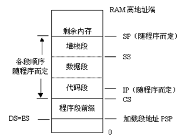
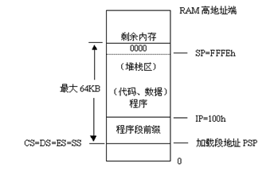

# 实验一

## EXE文件的编程格式

利用程序开发工具，通常生成.EXE结构的可执行程序有独立的代码、数据和堆栈段，还可以有多个代码段或多个数据段。在程序段内偏移0处，DOS为该程序建立一个程序段前缀控制块PSP，它占256（=100h）个字节；而在偏移100h处才装入程序本身。

### .EXE程序的内存映象图

### （1）简化格式操作练习

程序的功能：[计算M-N+P](./M-N+P.asm)

### （2）完整格式操作练习

程序的功能：[显示10行HELLO](./hello.asm)

程序的功能：[二进制到十六进制的转换](./BinToHex.asm)

## .COM文件的编程格式

.COM程序的所有代码、数据都在一个逻辑段内，不超过64KB。在程序开发时，需要满足一定要求才能正确生成COM结构的程序。尽管DOS也为COM程序建立程序段前缀PSP，但由于两种文件结构不同，所以加载到主存后各段设置并不完全一样。

## .COM程序的内存映象图

### （1）简化格式操作练习

程序的功能：[按键响铃](./alarm.asm)

### （2）完整格式操作练习

程序的功能：[统计键入字符‘0’和字符‘1’的个数](./count.asm)
