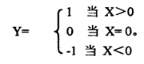

# 实验二

## 顺序、分支、循环结构程序设计并调试、运行

### [1.顺序程序设计——查表法实现BCD码转换为ASCII码程序](./BCDtoASCII.asm)

有10个BCD码存在BCDM为首地址的内存单元，将它们转换成ASCII码，并存放在首地址为ASC2的内存单元

### [2、分支程序设计——求函数Y的值](./function.asm)

### [3、循环程序设计——排序](./sort.asm)

假设内存中BUF单元开始有若干个单字节无符号数，要求把它们按数值大小，从小到大重新排列。
算法：

1.排序的关键问题是进行数的比较，首先设置一个交换标志(FLAG单元)，每一轮比较开始，首先令交换标志FLAG=O，然后进行若干次相邻两单元的数的比较。每次比较之后，把小数存入低地址单元，大数存入高地址单元。只要发生—次数据交换，就令交换标志FLAG=1，如果没有进行数据交换，则FLAG应保持不变。第一轮比较之后，最大数存入数组的末地址单元。

2.每一轮比较结束，检查交换标志位，若FLAG=1进行下一轮比较，FLAG=0表示排序结束。

3.N个数，第一轮比较N-1次，第二轮比较N-2次……。
